# Tashkeel Dashboard — User Flows Documentation

## 📋 نظرة عامة

هذا المستند يوثق جميع مسارات المستخدمين (User Flows) في لوحة تحكم Tashkeel.

**الممثلون الرئيسيون:**
- 👨‍💼 **Admin** — مدير النظام الكامل
- 👨‍🎨 **Theme Creator** — منشئ الثيمات
- 📊 **Analyst** — محلل البيانات والإحصائيات
- 📢 **Marketer** — مسؤول التسويق
- ✍️ **Content Editor** — محرر المحتوى
- 🎧 **Support Agent** — وكيل الدعم

---

## 1️⃣ Overview / الرئيسية

### السيناريو الأساسي: Admin يفتح Dashboard

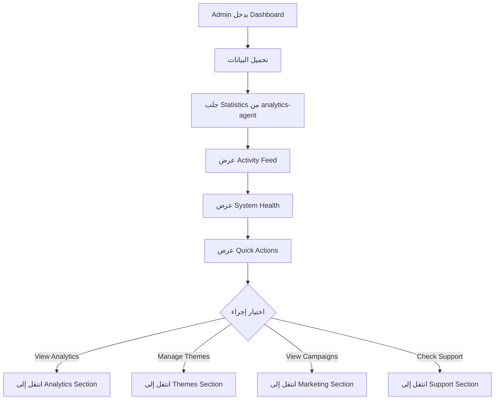

### العناصر المعروضة:

| العنصر | الوصف | المصدر |
|--------|-------|--------|
| **Key Metrics** | مبيعات اليوم، تنزيلات، عدد الثيمات النشطة | analytics-agent |
| **Top Themes** | أكثر 5 ثيمات تحميلاً هذا الأسبوع | analytics-agent |
| **Recent Sales** | آخر 10 عمليات شراء | payments API |
| **Activity Log** | آخر الإجراءات من جميع الوكلاء | event bus (Redis) |
| **System Status** | حالة الوكلاء والأنظمة | health check |
| **Pending Tasks** | ثيمات قيد المراجعة، تذاكر دعم جديدة | content-agent, support-agent |

### التفاعلات:
- ✅ Real-time updates (WebSocket من analytics-agent)
- ✅ Notifications (عند بيع جديدة، دعم عاجل)
- ✅ Quick filters (Today, This Week, This Month)

---

## 2️⃣ Themes Management

### السيناريو 1: إنشاء ثيمة جديدة (Theme Creator)

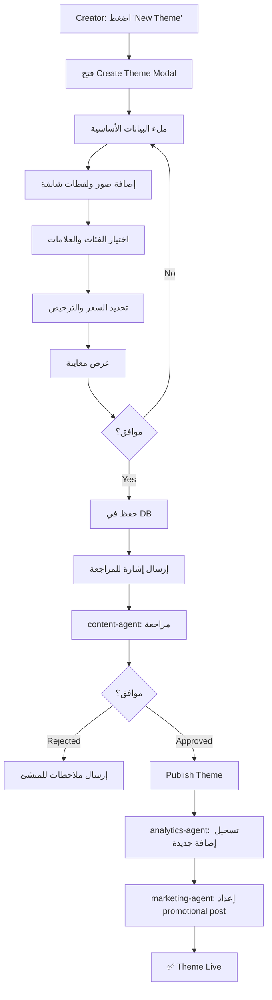

### السيناريو 2: تعديل ثيمة موجودة

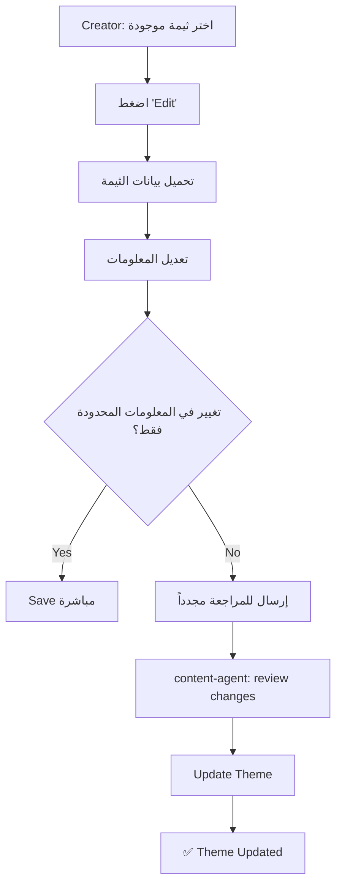

### السيناريو 3: حذف ثيمة (Admin فقط)

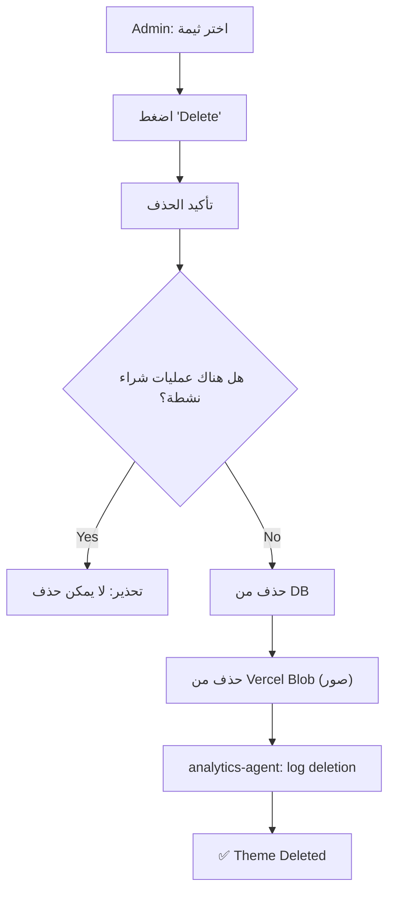

### معلومات الثيمة:

```
┌─ Basic Info
│  ├─ Name (عربي + English)
│  ├─ Description
│  ├─ Version
│  └─ Slug (URL-friendly)
│
├─ Visual
│  ├─ Thumbnail (رئيسي)
│  ├─ Screenshots (3-5)
│  ├─ Demo URL
│  └─ Preview Colors
│
├─ Categorization
│  ├─ Category (Business, Blog, E-commerce, etc.)
│  ├─ Tags (responsive, minimal, dark, RTL, etc.)
│  └─ Features (search, comments, social, etc.)
│
├─ Pricing & License
│  ├─ Price (USD)
│  ├─ License Type (GPL, MIT, Proprietary)
│  ├─ Support Duration
│  └─ Update Frequency
│
└─ Meta
   ├─ Creator
   ├─ Created Date
   ├─ Last Updated
   ├─ Status (draft, review, published, archived)
   └─ Download Count
```

---

## 3️⃣ Analytics & Insights

### السيناريو 1: Analyst يفتح Analytics Dashboard

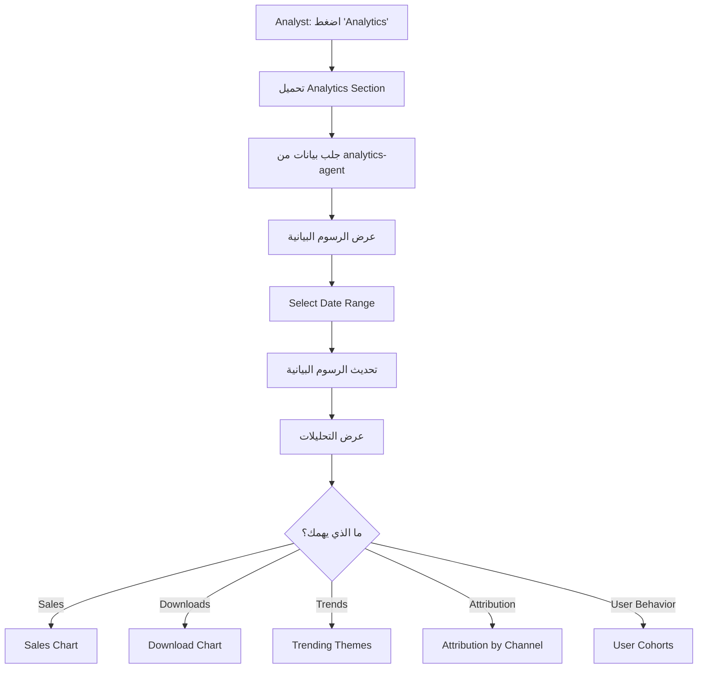

### الرسوم البيانية الرئيسية:

| الرسم البياني | البيانات | التحديث |
|-------------|---------|--------|
| **Sales Overview** | إجمالي الإيرادات، المتوسط، النمو | يومي |
| **Downloads Trend** | تنزيلات الثيمات عبر الوقت | يومي |
| **Top Themes** | أكثر الثيمات مبيعاً وتنزيلاً | يومي |
| **Revenue by Theme** | الإيرادات مقسمة حسب الثيمة | يومي |
| **Attribution** | من أين أتى العميل (direct, email, social) | يومي |
| **Funnel** | Landing → Browse → Purchase | يومي |
| **Customer Cohorts** | متى انضم العميل وسلوكه | أسبوعي |
| **Device/Browser** | آي الأجهزة والمتصفحات الشهيرة | يومي |

### السيناريو 2: إنشاء Report مخصص

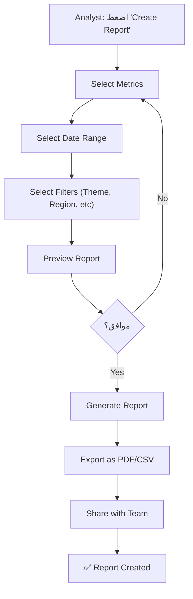

### السيناريو 3: Setting Up Alerts

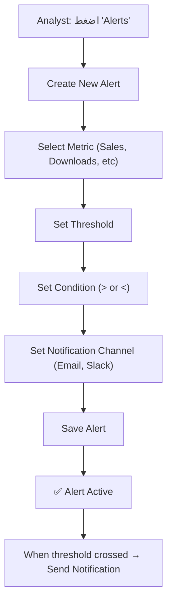

---

## 4️⃣ Marketing & Campaigns

### السيناريو 1: Marketer ينشئ Campaign

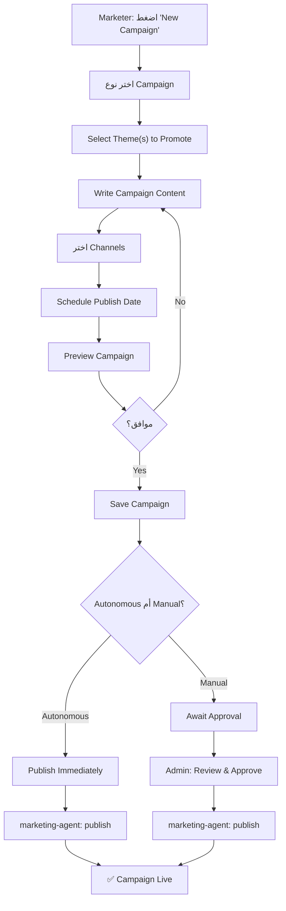

### أنواع Campaigns:

```
1. EMAIL CAMPAIGN
   ├─ Subject
   ├─ Recipients (segmented by behavior)
   ├─ Email Template
   ├─ A/B Testing (Subject, Content)
   └─ Send Time

2. SOCIAL MEDIA CAMPAIGN
   ├─ Platform (Facebook, Instagram, TikTok)
   ├─ Caption (RTL Support)
   ├─ Images/Videos
   ├─ Hashtags
   ├─ Scheduling
   └─ Paid vs Organic

3. PRODUCT LAUNCH
   ├─ New Theme Announcement
   ├─ Features Highlight
   ├─ Promo Code Generation
   ├─ Landing Page Link
   └─ Launch Timeline

4. SEASONAL/SPECIAL
   ├─ Holiday Campaigns
   ├─ Flash Sales
   ├─ Bundle Deals
   └─ Limited Time Offers
```

### السيناريو 2: مراجعة Campaign Performance

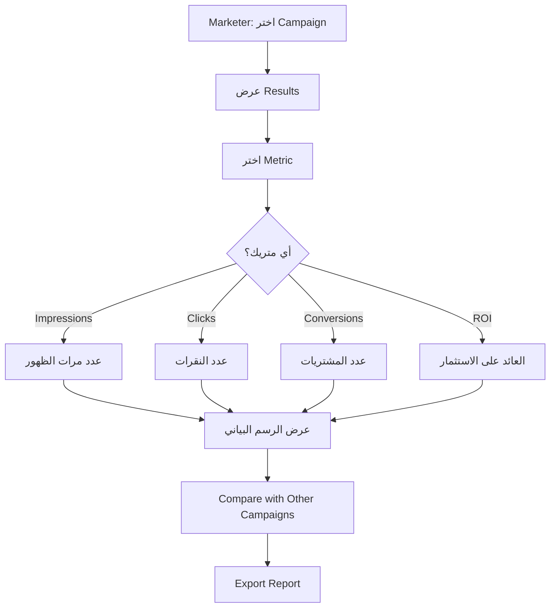

### القنوات المسموحة:

```
🟢 AUTONOMOUS (Self-Execute)
├─ Facebook Organic Posts
├─ Instagram Organic Posts
├─ TikTok Organic Videos
└─ WhatsApp Messages

🟡 REQUIRES APPROVAL (Proposal → Admin Review)
├─ Google Ads
├─ Meta Paid Ads
├─ Email with Discounts
└─ Influencer Partnerships

❌ NOT ALLOWED
└─ Spam/Phishing/Misleading Content
```

---

## 5️⃣ Content Management

### السيناريو 1: Content Editor ينشئ مقالة

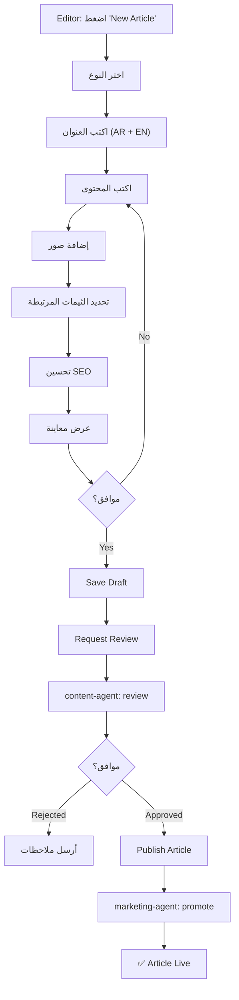

### أنواع المحتوى:

```
1. BLOG POSTS
   ├─ Tutorial (how-to guides)
   ├─ Case Study (success stories)
   ├─ News (updates, releases)
   └─ Opinion (industry insights)

2. THEME DESCRIPTIONS
   ├─ Feature Highlights
   ├─ Installation Guide
   ├─ Customization Tips
   └─ FAQ

3. KNOWLEDGE BASE
   ├─ Getting Started
   ├─ Troubleshooting
   ├─ Best Practices
   └─ API Documentation

4. MARKETING COPY
   ├─ Landing Page Copy
   ├─ Email Content
   ├─ Social Media Posts
   └─ Ad Copy
```

### السيناريو 2: Review Workflow

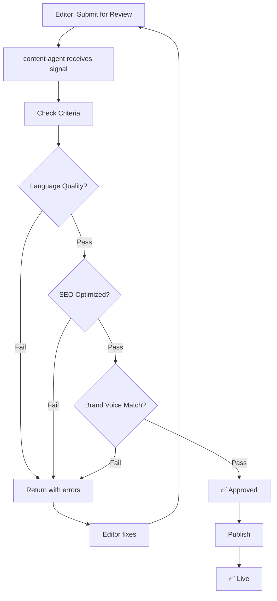

---

## 6️⃣ Support & Tickets

### السيناريو 1: Support Agent يفتح Tickets

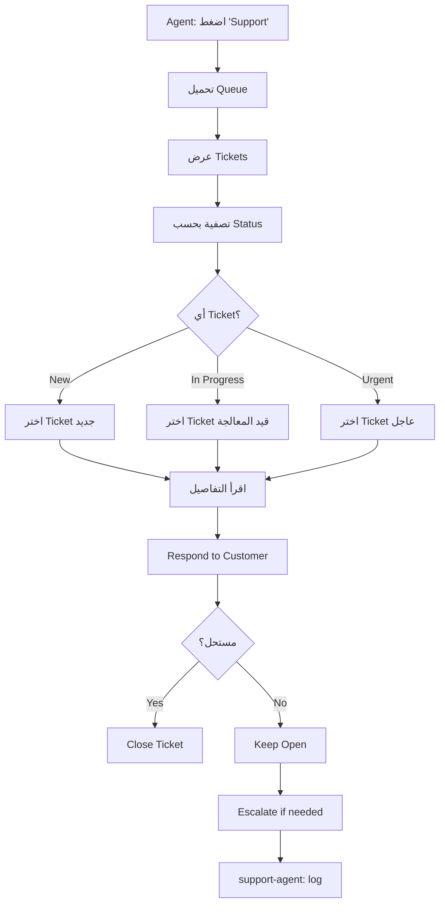

### الحقول الرئيسية للـ Ticket:

| الحقل | الوصف |
|-------|-------|
| **ID** | معرف فريد |
| **Customer** | بيانات المشتري |
| **Subject** | موضوع المشكلة |
| **Description** | وصف مفصل |
| **Category** | (Installation, Bug, Feature Request, Billing) |
| **Priority** | (Low, Medium, High, Urgent) |
| **Status** | (New, In Progress, Waiting for Customer, Resolved, Closed) |
| **Assigned To** | وكيل الدعم المسؤول |
| **Created At** | تاريخ الإنشاء |
| **Updated At** | آخر تحديث |
| **Resolution** | شرح الحل |

### السيناريو 2: استخدام Knowledge Base

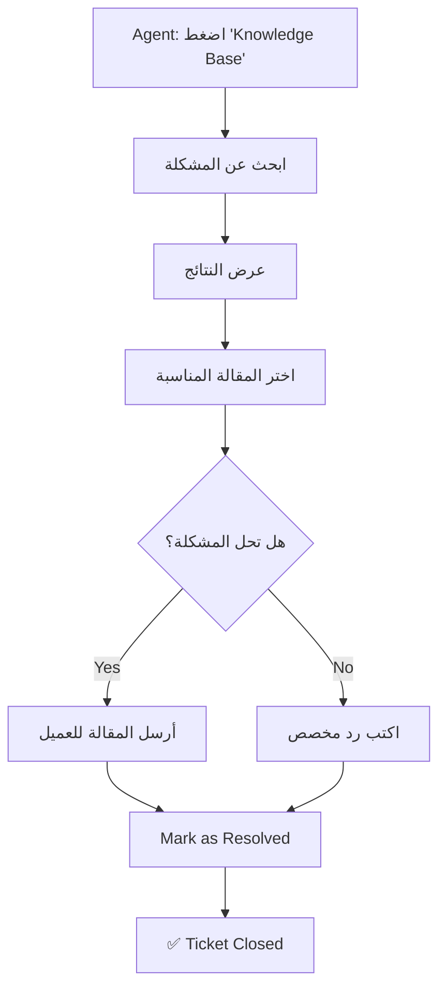

### السيناريو 3: Escalation Process

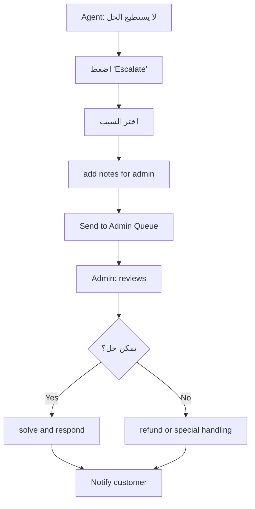

---

## 7️⃣ Payments & Transactions

### السيناريو 1: Viewing Transactions

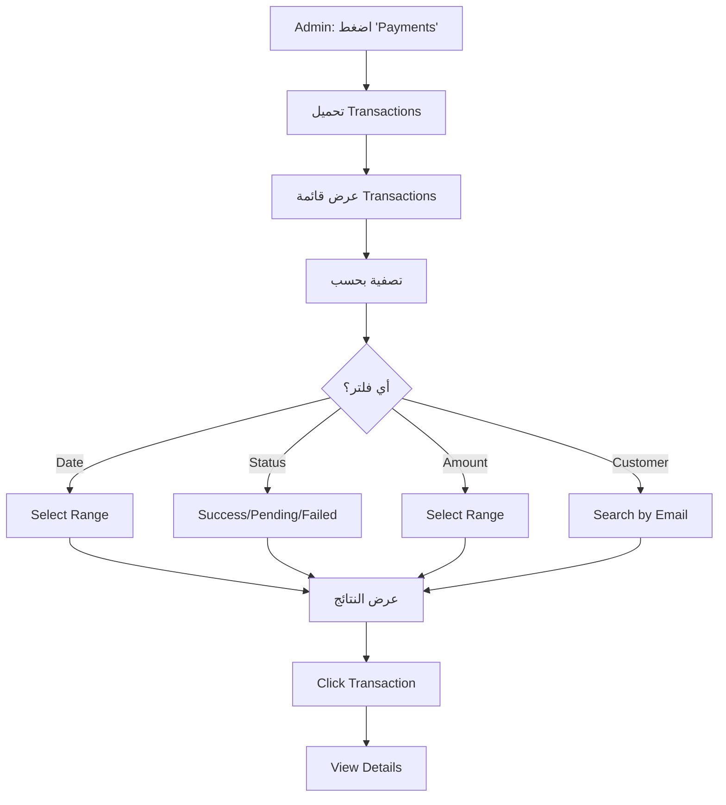

### بيانات Transaction:

```
┌─ Transaction ID
├─ Date & Time
├─ Customer
│  ├─ Name
│  ├─ Email
│  └─ Country
│
├─ Item
│  ├─ Theme Name
│  ├─ License Type
│  └─ Support Duration
│
├─ Payment
│  ├─ Amount (USD)
│  ├─ Currency
│  ├─ Method (Credit Card, PayPal, etc)
│  └─ Status (Success, Pending, Failed, Refunded)
│
└─ Metadata
   ├─ Invoice URL
   ├─ Receipt Sent: Yes/No
   └─ Support Ticket: Link
```

### السيناريو 2: Handling Refund Request

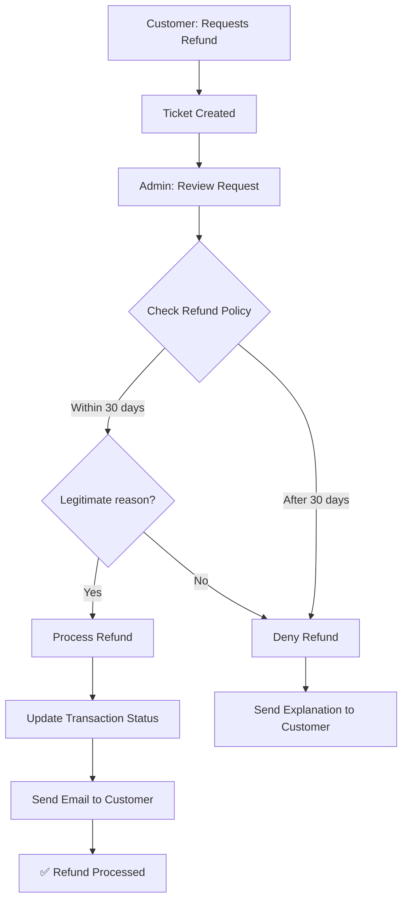

### السيناريو 3: Invoice Generation

```mermaid
graph TD
    A["Transaction Completed"] --> B["Generate Invoice"]
    B --> C["Store in Vercel Blob"]
    C --> D["Send Email to Customer"]
    D --> E["Log in system"]
    E --> F{"Customer requests duplicate?"]
    F -->|Yes| G["Retrieve from Blob"]
    F -->|No| H["✅ Complete"]
    G --> I["Send Email"]
    I --> H
```

---

## 🔄 Agent Interactions

### Communication Flows:

```
┌─────────────────────────────────────────────────┐
│              REDIS EVENT BUS                    │
└──────┬──────────────────────────────────────────┘
       │
   ┌───┴────┬─────────┬────────┬──────────┐
   │        │         │        │          │
   ▼        ▼         ▼        ▼          ▼
 ANALYTICS MARKETING CONTENT SUPPORT PLATFORM
 AGENT     AGENT     AGENT    AGENT     AGENT


SIGNALS (Analytics → Others):
- NEW_SALE: Sales Agent → Marketing (promote)
- THEME_TRENDING: Analytics → Marketing (create campaign)
- HIGH_REFUND_RATE: Analytics → Support (investigate)
- QUALITY_ISSUE: Analytics → Content (review theme)

COMMANDS (Dashboard → Agents):
- PUBLISH_THEME → Content Agent
- SCHEDULE_CAMPAIGN → Marketing Agent
- GENERATE_REPORT → Analytics Agent
- CREATE_ESCALATION → Support Agent
```

---

## 📊 Data Flow Architecture

```
Dashboard
   │
   ├─→ Vercel Functions (API Routes)
   │    └─→ Neon Postgres (State)
   │
   ├─→ Redis Event Bus (Real-time signals)
   │    ├─→ Analytics Agent (listens to events)
   │    ├─→ Marketing Agent (listens to ANALYTICS_SIGNAL)
   │    ├─→ Content Agent (listens to CONTENT_REQUESTED)
   │    └─→ Support Agent (listens to TICKET_CREATED)
   │
   ├─→ Vercel Blob (File Storage)
   │    └─→ Theme screenshots, invoices, etc.
   │
   └─→ Vercel Analytics (Metrics)
        └─→ Dashboard charts & reports
```

---

## ⚡ Priority Actions & Quick Wins

### الإجراءات ذات الأولوية:

1. **Immediate (P0)**
   - ✅ View Dashboard overview
   - ✅ Create/Edit/Delete themes
   - ✅ View basic analytics
   - ✅ Create & publish campaigns
   - ✅ Manage support tickets

2. **Short-term (P1)**
   - ✅ Custom reports
   - ✅ Alert system
   - ✅ Bulk operations
   - ✅ Export functionality
   - ✅ Team collaboration

3. **Medium-term (P2)**
   - 📋 Automation workflows
   - 📋 AI-powered recommendations
   - 📋 Advanced segmentation
   - 📋 Predictive analytics
   - 📋 Multi-language UI

---

## 🎯 Success Metrics

- ✅ Page load time < 2s
- ✅ All actions < 1s response time
- ✅ Real-time updates (< 5s)
- ✅ 99.9% uptime
- ✅ Zero data loss
- ✅ Audit trail for all actions
- ✅ Mobile responsive
- ✅ Accessibility (WCAG 2.1 AA)
